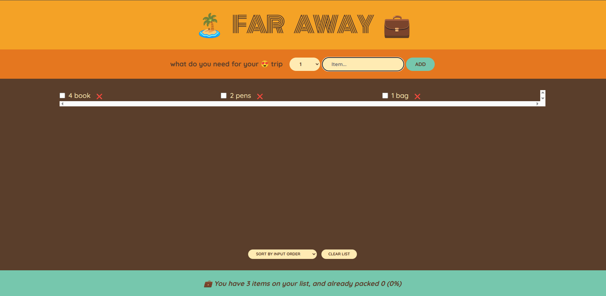

# 🌍 Far Away App

A simple React project built as part of my learning journey.  
It helped me practice **state management** and communication between components.

---

## 🛠 What I Learned

- 🗂 **State Management** – Using `useState` to store and update data.  
- 📤 **Lifting State Up** – Sharing data between components by moving state to a common ancestor.  
- 🔄 **Derived State** – Calculating values from existing state for cleaner, more efficient code.  
- 📩 **Child-to-Parent Communication** – Passing data and events from child components back to the parent using props.

---

## 🚀 Purpose

This project was created to strengthen my understanding of **how React components interact and manage data flow**.

---

## 📷 Screenshot

---

## 📦 Tech Stack

- **React** (with Hooks)
- **JavaScript (ES6+)**
- **CSS**

---

💡 *Part of my continuous journey to becoming a better React developer.*
